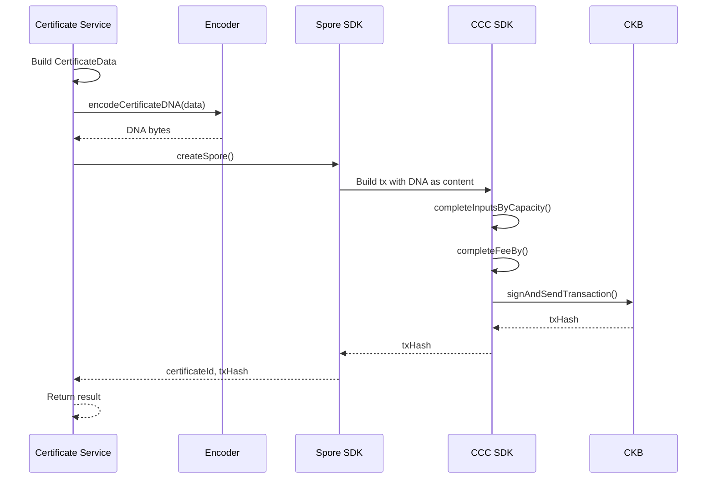
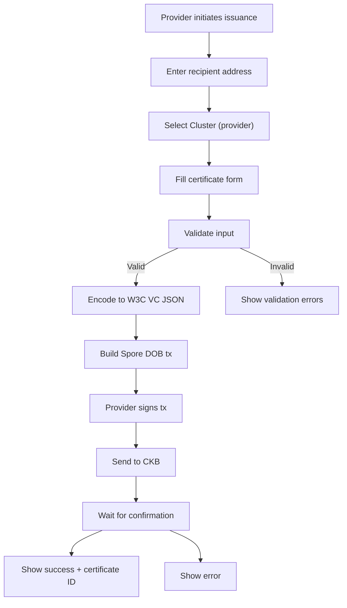
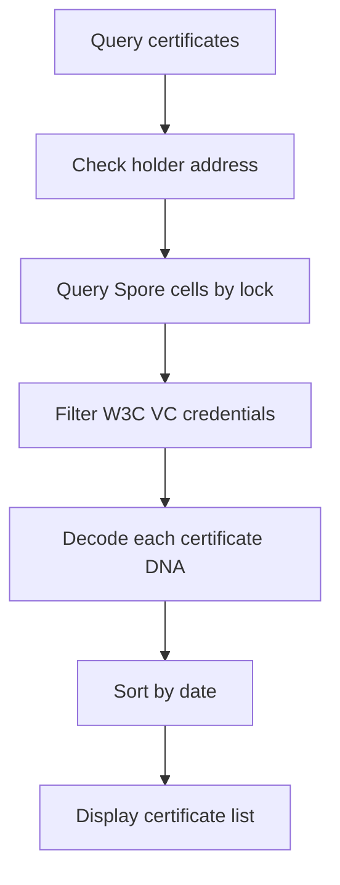

# Certificate Service — Unit Design

## 1. Overview

| Item | Details |
|------|---------|
| **Module** | Certificate Service |
| **File** | `src/lib/credentials/issuer.ts` |
| **Purpose** | Issue and manage course completion certificates |
| **Dependencies** | `@spore-sdk/core`, `@ckb-ccc/core`, Encoder/Decoder |

---

## 2. Purpose

The Certificate Service handles the issuance and management of course completion certificates as Spore DOBs. It coordinates between the Encoder module and Spore SDK to create, query, and revoke certificates.

---

## 3. Public API

### 3.1 Functions

```typescript
// Issue a single certificate
async function issueCertificate(
  signer: ccc.Signer,
  params: IssueCertificateParams
): Promise<IssueCertificateResult>

// Get all certificates owned by a holder
async function getHolderCertificates(
  client: ccc.Client,
  holderLock: Script
): Promise<CertificateWithId[]>

// Get certificates issued by a provider
async function getProviderCertificates(
  client: ccc.Client,
  clusterId: string
): Promise<CertificateWithId[]>

// Revoke a certificate
async function revokeCertificate(
  signer: ccc.Signer,
  certificateId: string,
  reason: string
): Promise<RevokeCertificateResult>

// Get a specific certificate by ID
async function getCertificate(
  client: ccc.Client,
  certificateId: string
): Promise<CertificateWithId | null>
```

### 3.2 Types

```typescript
interface IssueCertificateParams {
  clusterId: string;
  recipientAddress: string;
  issuerName: string;
  issuerDescription?: string;
  course: CourseInfo;
  expirationDate?: string;
  policy?: CertificatePolicy;
  templateId?: string;
}

interface CourseInfo {
  name: string;
  description?: string;
  duration?: string;
  institution?: string;
  completionDate: string;
  grade?: string;
  score?: number;
  skills?: string[];
}

interface CertificatePolicy {
  transferable: boolean;
  allowRenewal: boolean;
}

interface IssueCertificateResult {
  certificateId: string;
  transactionHash: string;
}

interface CertificateWithId {
  id: string;
  certificate: CertificateDNA;
  transactionHash: string;
  createdAt: string;
}

interface RevokeCertificateResult {
  transactionHash: string;
}
```

---

## 4. Function Specifications

### 4.1 issueCertificate

**Purpose**: Issue a course completion certificate to a student.

**Parameters**:
| Param | Type | Required | Description |
|-------|------|----------|-------------|
| `signer` | `ccc.Signer` | Yes | Provider's wallet signer |
| `params` | `IssueCertificateParams` | Yes | Certificate issuance details |

**Process**:


**Returns**: `IssueCertificateResult`

**Transaction Details**:
```
Input:  Provider's CKB cells (for capacity + fee)
Output: Certificate DOB Cell
        - Type: SPORE
        - Lock: Recipient's wallet
        - Data: W3C VC JSON (Certificate DNA)
Fee:    ~0.001 CKB
```

**Errors**:
| Error | Condition |
|-------|-----------|
| `INVALID_ADDRESS` | Invalid recipient address |
| `CLUSTER_NOT_FOUND` | Cluster ID not found |
| `INSUFFICIENT_BALANCE` | Not enough CKB |
| `WALLET_NOT_CONNECTED` | Signer not available |

### 4.2 getHolderCertificates

**Purpose**: Get all certificates owned by a student's wallet.

**Parameters**:
| Param | Type | Required | Description |
|-------|------|----------|-------------|
| `client` | `ccc.Client` | Yes | CKB client |
| `holderLock` | `Script` | Yes | Student's lock script |

**Returns**: `CertificateWithId[]`

**Process**:
1. Query all Spore cells owned by holder
2. Filter for W3C VC credentials (application/json)
3. Decode each cell's DNA
4. Return certificates with IDs

### 4.3 getProviderCertificates

**Purpose**: Get all certificates issued by a provider's Cluster.

**Parameters**:
| Param | Type | Required | Description |
|-------|------|----------|-------------|
| `client` | `ccc.Client` | Yes | CKB client |
| `clusterId` | `string` | Yes | Provider's Cluster ID |

**Returns**: `CertificateWithId[]`

**Note**: This requires tracking issued certificates off-chain or using an indexer that supports cluster queries.

### 4.4 revokeCertificate

**Purpose**: Mark a certificate as revoked.

**Parameters**:
| Param | Type | Required | Description |
|-------|------|----------|-------------|
| `signer` | `ccc.Signer` | Yes | Provider's wallet signer |
| `certificateId` | `string` | Yes | Certificate to revoke |
| `reason` | `string` | Yes | Revocation reason |

**Process**:
1. Find certificate cell
2. Verify signer is issuer (matches Cluster owner)
3. Update credentialStatus in DNA
4. Create new cell with updated DNA
5. Burn old cell

**Note**: Current implementation updates off-chain status. Full on-chain revocation requires custom script (Future).

**Returns**: `RevokeCertificateResult`

### 4.5 getCertificate

**Purpose**: Get a specific certificate by ID.

**Parameters**:
| Param | Type | Required | Description |
|-------|------|----------|-------------|
| `client` | `ccc.Client` | Yes | CKB client |
| `certificateId` | `string` | Yes | Certificate ID |

**Returns**: `CertificateWithId | null`

**Process**:
1. Query cell by type script args
2. Decode DNA
3. Return CertificateWithId or null

---

## 5. Data Flow

### 5.1 Certificate Issuance Flow



### 5.2 Certificate Query Flow



---

## 6. Implementation Notes

### 6.1 Spore DOB Creation

```typescript
import { createSpore } from '@spore-sdk/core';

const dnaBytes = encodeCertificateDNA(certificateData);

const { txSkeleton, outputIndex } = await createSpore({
  data: {
    contentType: 'application/json',
    content: dnaBytes,
    clusterId: params.clusterId,
  },
  toLock: recipientLockScript,
  fromInfos: [providerAddress],
  config: sporeConfig,
});
```

### 6.2 Certificate ID

Certificate ID = Type script args của Spore DOB Cell
- Format: 32-byte hex string
- Derived from transaction during creation

### 6.3 Cell Query

```typescript
// Find certificate by ID
const cells = await client.findCellsByType({
  script: {
    codeHash: SPORE_CODE_HASH,
    hashType: 'data2',
    args: certificateId,
  },
});
```

---

## 7. Error Handling

| Error | Condition | User Message |
|-------|-----------|--------------|
| `INVALID_ADDRESS` | Malformed recipient address | "Invalid wallet address" |
| `CLUSTER_NOT_FOUND` | Cluster doesn't exist | "Provider cluster not found" |
| `INSUFFICIENT_BALANCE` | Not enough CKB | "Insufficient CKB balance" |
| `NOT_ISSUER` | Signer not Cluster owner | "You are not the issuer" |
| `ALREADY_REVOKED` | Certificate already revoked | "Certificate is already revoked" |

---

## 8. Testing

### 8.1 Unit Tests

| Test Case | Expected Result |
|-----------|-----------------|
| Issue with valid params | Returns certificateId and txHash |
| Issue with invalid address | Throws INVALID_ADDRESS |
| Issue with unknown cluster | Throws CLUSTER_NOT_FOUND |
| Get holder certificates | Returns array of certificates |
| Get holder with no certs | Returns empty array |
| Get non-existent cert | Returns null |

### 8.2 Integration Tests

| Test Case | Expected Result |
|-----------|-----------------|
| Issue → Query by holder | Certificate in results |
| Issue → Get by ID | Correct certificate data |
| Issue → Verify on explorer | Cell exists on chain |

---

## 9. Related Documents

| Document | Path |
|----------|------|
| Implementation Architecture | `Design_spec/Implementation_Architecture.md` |
| Cluster Service | `Design_spec/01_Cluster_Service.md` |
| Encoder/Decoder | `Design_spec/02_Encoder_Decoder.md` |
| Verification Service | `Design_spec/04_Verification_Service.md` |

---

*Version: 1.0*
*Last Updated: 2026-08-11*
