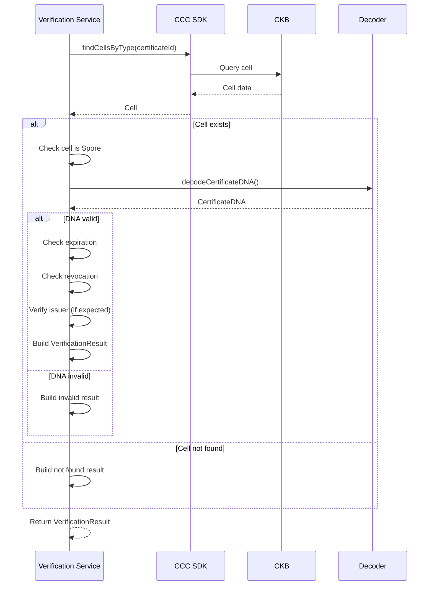
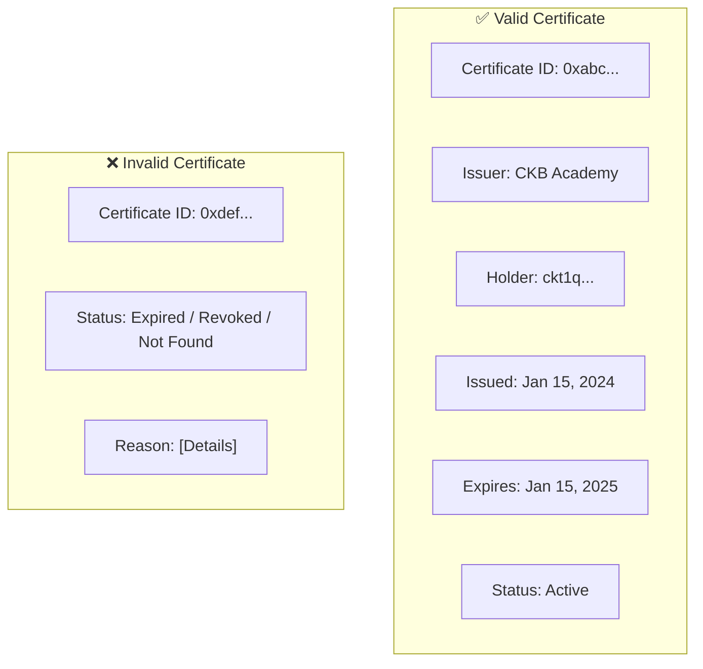

# Verification Service — Unit Design

## 1. Overview

| Item | Details |
|------|---------|
| **Module** | Verification Service |
| **File** | `src/lib/credentials/verifier.ts` |
| **Purpose** | Verify certificate authenticity and status |
| **Dependencies** | `@ckb-ccc/core`, Decoder |

---

## 2. Purpose

The Verification Service provides functionality to verify certificates by querying the CKB blockchain, decoding the certificate DNA, and checking validity, expiration, and revocation status.

---

## 3. Public API

### 3.1 Functions

```typescript
// Verify a certificate by ID
async function verifyCertificate(
  client: ccc.Client,
  certificateId: string,
  options?: VerifyOptions
): Promise<VerificationResult>

// Get verification history (optional)
async function getVerificationHistory(
  certificateId: string
): Promise<VerificationRecord[]>
```

### 3.2 Types

```typescript
interface VerifyOptions {
  expectedIssuerId?: string;
  expectedHolderId?: string;
  checkExpiration?: boolean;
}

interface VerificationResult {
  valid: boolean;
  certificateId: string;
  issuer: {
    id: string;
    name: string;
    clusterVerified: boolean;
  };
  holder: {
    address: string;
    ownershipVerified: boolean;
  };
  certificate: {
    type: string[];
    issuanceDate: string;
    expirationDate?: string;
    isExpired: boolean;
    isRevoked: boolean;
  };
  checks: VerificationChecks;
  timestamp: string;
  transactionHash?: string;
}

interface VerificationChecks {
  cellExists: boolean;
  dnaValid: boolean;
  issuerVerified: boolean;
  expirationVerified: boolean;
  revocationVerified: boolean;
}

interface VerificationRecord {
  verifiedAt: string;
  verifier?: string;
  result: boolean;
}
```

---

## 4. Function Specifications

### 4.1 verifyCertificate

**Purpose**: Verify a certificate's authenticity and status.

**Parameters**:
| Param | Type | Required | Description |
|-------|------|----------|-------------|
| `client` | `ccc.Client` | Yes | CKB client |
| `certificateId` | `string` | Yes | Certificate ID to verify |
| `options` | `VerifyOptions` | No | Verification options |

**Returns**: `VerificationResult`

**Process**:



**Verification Checks**:

| Check | Description | Pass Condition |
|-------|-------------|----------------|
| `cellExists` | Certificate cell exists on chain | Cell found |
| `dnaValid` | DNA decodes to valid W3C VC | Decode succeeds |
| `issuerVerified` | Issuer matches expected (if provided) | Issuer ID matches |
| `expirationVerified` | Certificate not expired | Not past expirationDate |
| `revocationVerified` | Certificate not revoked | revoked !== true |

**Validity Logic**:
```typescript
const valid = 
  checks.cellExists &&
  checks.dnaValid &&
  (!options?.expectedIssuerId || checks.issuerVerified) &&
  (!options?.checkExpiration || !checks.expirationVerified || !certificate.isExpired) &&
  !certificate.isRevoked;
```

### 4.2 getVerificationHistory

**Purpose**: Get historical verification records (optional feature).

**Note**: This requires off-chain storage for verification records.

**Returns**: `VerificationRecord[]`

---

## 5. Verification Result Structure

### 5.1 Valid Certificate

```typescript
{
  valid: true,
  certificateId: "0xabc123...",
  issuer: {
    id: "did:ckb:issuer:cluster:0xyz...",
    name: "CKB Academy",
    clusterVerified: true,
  },
  holder: {
    address: "ckt1q...",
    ownershipVerified: true,
  },
  certificate: {
    type: ["VerifiableCredential", "CourseCertificate"],
    issuanceDate: "2024-01-15T00:00:00Z",
    expirationDate: "2025-01-15T00:00:00Z",
    isExpired: false,
    isRevoked: false,
  },
  checks: {
    cellExists: true,
    dnaValid: true,
    issuerVerified: true,
    expirationVerified: true,
    revocationVerified: true,
  },
  timestamp: "2024-06-01T12:00:00Z",
  transactionHash: "0xdef456...",
}
```

### 5.2 Invalid Certificate (Expired)

```typescript
{
  valid: false,
  certificateId: "0xabc123...",
  // ... other fields
  certificate: {
    // ...
    expirationDate: "2024-01-15T00:00:00Z",
    isExpired: true,
    isRevoked: false,
  },
  checks: {
    // ...
    expirationVerified: false,  // FAILED
  },
}
```

### 5.3 Invalid Certificate (Not Found)

```typescript
{
  valid: false,
  certificateId: "0xabc123...",
  issuer: { id: "", name: "", clusterVerified: false },
  holder: { address: "", ownershipVerified: false },
  certificate: {
    type: [],
    issuanceDate: "",
    isExpired: false,
    isRevoked: false,
  },
  checks: {
    cellExists: false,  // FAILED
    dnaValid: false,
    issuerVerified: false,
    expirationVerified: false,
    revocationVerified: false,
  },
  timestamp: "2024-06-01T12:00:00Z",
}
```

---

## 6. UI Display

### 6.1 Verification Result Display



### 6.2 Verification Status Badges

| Status | Badge | Color |
|--------|-------|-------|
| Active | ✅ Valid | Green |
| Expired | ⚠️ Expired | Yellow |
| Revoked | ❌ Revoked | Red |
| Not Found | ❌ Not Found | Red |

---

## 7. Error Handling

| Error | Condition | Handling |
|-------|-----------|----------|
| Cell not found | Certificate doesn't exist | Return invalid result with cellExists: false |
| Decode failed | Invalid DNA | Return invalid result with dnaValid: false |
| Network error | CKB unreachable | Throw error, let UI handle |

---

## 8. Testing

### 8.1 Unit Tests

| Test Case | Input | Expected Result |
|-----------|-------|----------------|
| Verify valid cert | Existing cert ID | valid: true |
| Verify expired cert | Expired cert ID | valid: false, isExpired: true |
| Verify revoked cert | Revoked cert ID | valid: false, isRevoked: true |
| Verify not found | Non-existent ID | valid: false, cellExists: false |
| Verify with expected issuer | Wrong issuer ID | valid: false, issuerVerified: false |
| Verify with correct issuer | Correct issuer ID | valid: true |

### 8.2 Integration Tests

| Test Case | Expected Result |
|-----------|-----------------|
| Issue → Verify | Verification succeeds |
| Issue → Expire (mock time) → Verify | Shows expired |
| Issue → Revoke → Verify | Shows revoked |

---

## 9. Related Documents

| Document | Path |
|----------|------|
| Implementation Architecture | `Design_spec/Implementation_Architecture.md` |
| Certificate Service | `Design_spec/03_Certificate_Service.md` |
| Encoder/Decoder | `Design_spec/02_Encoder_Decoder.md` |

---

*Version: 1.0*
*Last Updated: 2026-08-11*
