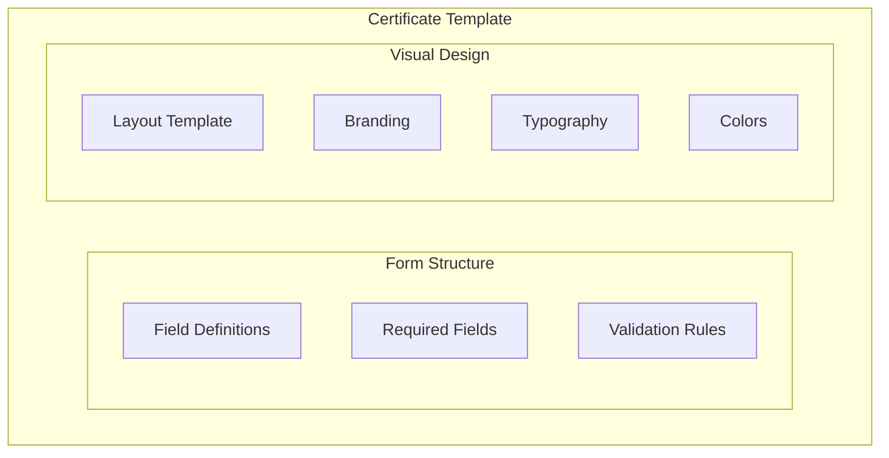
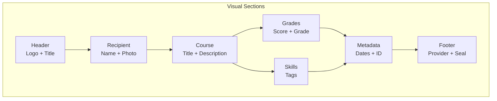

# Template Service — Unit Design

## 1. Overview

| Item | Details |
|------|---------|
| **Module** | Template Service |
| **File** | `src/lib/credentials/templates.ts` |
| **Purpose** | Manage certificate templates including visual design and form fields |
| **Dependencies** | None (client-side storage) |

---

## 2. Purpose

The Template Service manages certificate templates that providers can create and use for consistent certificate issuance. Templates define both the **form structure** (fields for data collection) and the **visual design** (how the certificate looks when rendered).

---

## 3. Template Components

A certificate template consists of two main parts:



### 3.1 Form Structure
- Field definitions (what data to collect)
- Required fields (mandatory vs optional)
- Validation rules (data constraints)

### 3.2 Visual Design
- Layout template (how certificate is rendered)
- Branding (logo, provider info)
- Typography (fonts, sizes)
- Colors (theme, accents)

---

## 4. Public API

### 4.1 Functions

```typescript
// Template CRUD
function createTemplate(clusterId: string, template: TemplateInput): Template
function getTemplates(clusterId: string): Template[]
function getTemplate(clusterId: string, templateId: string): Template | null
function updateTemplate(clusterId: string, templateId: string, updates: Partial<TemplateInput>): Template
function deleteTemplate(clusterId: string, templateId: string): void

// Template Application
function applyTemplate(template: Template, data: Record<string, any>): CertificateData
function renderCertificate(template: Template, data: CertificateData): CertificateRender

// Visual Template
function getVisualLayout(layout: LayoutType): VisualLayout
function validateVisualConfig(config: VisualConfig): ValidationResult
```

### 4.2 Types

```typescript
// ===== CORE TEMPLATE TYPES =====

interface Template {
  id: string;
  clusterId: string;
  name: string;
  description: string;
  version: string;
  fields: TemplateField[];
  requiredFields: string[];
  defaultValues?: Record<string, any>;
  visual: VisualConfig;
  metadata: TemplateMetadata;
  createdAt: string;
  updatedAt: string;
}

interface TemplateInput {
  name: string;
  description: string;
  fields: TemplateField[];
  requiredFields: string[];
  defaultValues?: Record<string, any>;
  visual: VisualConfigInput;
}

interface TemplateMetadata {
  createdBy: string;
  lastModifiedBy: string;
  usageCount: number;
}

// ===== FORM FIELD TYPES =====

interface TemplateField {
  name: string;
  type: FieldType;
  label: string;
  placeholder?: string;
  required: boolean;
  helpText?: string;
  options?: FieldOption[];
  validation?: FieldValidation;
  showInCertificate: boolean;
  certificatePosition?: string;
}

type FieldType = 
  | 'text'           // Single line text
  | 'textarea'       // Multi-line text
  | 'email'          // Email address
  | 'url'            // Website URL
  | 'date'           // Date picker
  | 'datetime'       // Date and time
  | 'number'          // Numeric input
  | 'select'         // Dropdown
  | 'multiselect'    // Multiple selection
  | 'radio'          // Radio buttons
  | 'checkbox'       // Checkbox
  | 'skills'          // Skills tags
  | 'grade'          // Grade selector
  | 'file'           // File upload (logo, etc.)
  | 'readonly';      // Display only

interface FieldOption {
  value: string;
  label: string;
  description?: string;
}

interface FieldValidation {
  required?: boolean;
  minLength?: number;
  maxLength?: number;
  min?: number;
  max?: number;
  pattern?: string;
  patternMessage?: string;
  custom?: string;  // Custom validation function name
}

// ===== VISUAL DESIGN TYPES =====

interface VisualConfig {
  layout: LayoutType;
  branding: BrandingConfig;
  typography: TypographyConfig;
  colors: ColorConfig;
  sections: VisualSection[];
  background: BackgroundConfig;
  effects: EffectConfig;
}

interface VisualConfigInput {
  layout: LayoutType;
  branding?: Partial<BrandingConfig>;
  typography?: Partial<TypographyConfig>;
  colors?: Partial<ColorConfig>;
  sections?: VisualSection[];
  background?: Partial<BackgroundConfig>;
  effects?: Partial<EffectConfig>;
}

type LayoutType = 
  | 'classic'        // Traditional vertical layout
  | 'modern'         // Modern centered layout
  | 'compact'        // Minimal info layout
  | 'detailed'       // Full details layout
  | 'badge';         // Badge/icon style

interface BrandingConfig {
  showLogo: boolean;
  logoUrl?: string;
  logoPosition: 'top-left' | 'top-center' | 'top-right';
  logoSize: 'sm' | 'md' | 'lg' | 'xl';
  showProviderName: boolean;
  providerNamePosition: 'header' | 'footer';
  showProviderUrl: boolean;
  showSeal: boolean;
  sealType: 'none' | 'official' | 'custom';
  sealUrl?: string;
}

interface TypographyConfig {
  titleFont: string;
  titleSize: 'sm' | 'md' | 'lg' | 'xl';
  titleWeight: 'normal' | 'medium' | 'bold';
  bodyFont: string;
  bodySize: 'sm' | 'md' | 'lg';
  labelFont: string;
  labelStyle: 'uppercase' | 'capitalize' | 'normal';
  lineHeight: 'tight' | 'normal' | 'relaxed';
}

interface ColorConfig {
  theme: ColorTheme;
  primaryColor: string;
  secondaryColor: string;
  accentColor: string;
  backgroundColor: string;
  textColor: string;
  mutedColor: string;
  borderColor: string;
  customEnabled: boolean;
}

type ColorTheme = 
  | 'blue'    // Professional blue
  | 'purple'  // Creative purple
  | 'green'   // Growth green
  | 'gold'    // Achievement gold
  | 'red'     // Achievement red
  | 'custom'; // Custom colors

interface VisualSection {
  id: string;
  type: SectionType;
  title?: string;
  visible: boolean;
  position: number;
  fields: string[];
  style?: SectionStyle;
}

type SectionType = 
  | 'header'      // Certificate header/title
  | 'recipient'    // Recipient information
  | 'course'       // Course/achievement details
  | 'grades'       // Grades and scores
  | 'skills'       // Skills acquired
  | 'metadata'     // Dates, IDs
  | 'footer'       // Footer with issuer info
  | 'custom';      // Custom section

interface SectionStyle {
  background?: string;
  borderRadius?: 'none' | 'sm' | 'md' | 'lg';
  padding?: 'none' | 'sm' | 'md' | 'lg';
  border?: 'none' | 'solid' | 'dashed';
  borderColor?: string;
}

interface BackgroundConfig {
  type: 'solid' | 'gradient' | 'pattern' | 'image';
  color?: string;
  gradientFrom?: string;
  gradientTo?: string;
  gradientDirection?: 'top' | 'bottom' | 'left' | 'right';
  patternUrl?: string;
  imageUrl?: string;
  imageOpacity?: number;
}

interface EffectConfig {
  shadow: 'none' | 'sm' | 'md' | 'lg';
  borderStyle: 'none' | 'solid' | 'double';
  borderWidth: 'thin' | 'medium' | 'thick';
  animation?: 'none' | 'fade' | 'slide';
}

// ===== RENDERING =====

interface CertificateRender {
  html: string;
  css: string;
  dataUrl?: string;  // Base64 encoded image
  metadata: RenderMetadata;
}

interface RenderMetadata {
  width: number;
  height: number;
  format: 'html' | 'png' | 'pdf';
  generatedAt: string;
}
```

---

## 5. Visual Layout Specifications

### 5.1 Layout Types

#### Classic Layout
```
┌─────────────────────────────────────────────────────────────┐
│  ┌──────┐                                                   │
│  │ Logo │           CERTIFICATE OF COMPLETION               │
│  └──────┘                                                   │
│                                                              │
│                     ──────────────────                      │
│                        COURSE TITLE                          │
│                     ──────────────────                      │
│                                                              │
│  This certifies that                                       │
│                                                              │
│                      RECIPIENT NAME                          │
│                                                              │
│  has successfully completed                                 │
│                                                              │
│                 Course Description                           │
│                                                              │
│  Date: January 15, 2024                                    │
│  Grade: A                                                  │
│                                                              │
│  ─────────────────────    ─────────────────────            │
│  Provider Name                      [Official Seal]         │
│  www.provider.com                                         │
└─────────────────────────────────────────────────────────────┘
```

#### Modern Layout
```
┌─────────────────────────────────────────────────────────────┐
│                                                             │
│                    ╭─────────────────╮                     │
│                    │   CERTIFICATE  │                     │
│                    │                 │                     │
│                    │   [Logo]       │                     │
│                    │                 │                     │
│                    │   Provider      │                     │
│                    ╰─────────────────╯                     │
│                                                             │
│                         Recipient                           │
│                       ────────────                         │
│                       Name Here                            │
│                                                             │
│  ┌─────────────────────────────────────────────────────┐  │
│  │  Course: CKB Development Fundamentals                │  │
│  │  Date: January 15, 2024                             │  │
│  │  Grade: A                                           │  │
│  └─────────────────────────────────────────────────────┘  │
│                                                             │
└─────────────────────────────────────────────────────────────┘
```

#### Compact Layout
```
┌───────────────────────────────────────────┐
│  [Logo]  CERTIFICATE                    │
│                                           │
│  Recipient: Name                         │
│  Course: Course Name                     │
│  Date: Jan 15, 2024                     │
│                                           │
│  Provider          [Seal]                 │
└───────────────────────────────────────────┘
```

#### Badge Layout
```
        ┌─────────────┐
        │   ╭─────╮   │
        │   │     │   │
        │   │ 🎓  │   │
        │   │     │   │
        │   ╰─────╯   │
        │   BADGE     │
        │             │
        │  Recipient  │
        │  ─────────  │
        │  Course     │
        │             │
        │  2024       │
        └─────────────┘
```

### 5.2 Section Structure



### 5.3 Field Positioning

| Section | Available Fields |
|---------|-------------------|
| Header | `logo`, `certificateTitle` |
| Recipient | `recipientName`, `recipientEmail`, `recipientPhoto` |
| Course | `courseName`, `courseDescription`, `courseDuration`, `institution` |
| Grades | `grade`, `score`, `rank` |
| Skills | `skills` |
| Metadata | `completionDate`, `expirationDate`, `certificateId` |
| Footer | `providerName`, `providerUrl`, `seal`, `signature` |

---

## 6. Color Themes

### 6.1 Available Themes

| Theme | Primary | Secondary | Accent | Best For |
|-------|---------|-----------|--------|----------|
| **Blue** | #1E40AF | #3B82F6 | #60A5FA | Professional |
| **Purple** | #6B21A8 | #9333EA | #C084FC | Creative |
| **Green** | #166534 | #22C55E | #4ADE80 | Achievement |
| **Gold** | #92400E | #F59E0B | #FCD34D | Excellence |
| **Red** | #991B1B | #EF4444 | #F87171 | Achievement |
| **Custom** | User-defined | User-defined | User-defined | Branding |

### 6.2 Color Usage

| Element | Color Source |
|---------|-------------|
| Title text | `primaryColor` |
| Section headers | `secondaryColor` |
| Accents, badges | `accentColor` |
| Body text | `textColor` |
| Background | `backgroundColor` |
| Borders, dividers | `borderColor` |
| Muted text | `mutedColor` |

---

## 7. Typography

### 7.1 Font Families

| Font | Category | Use Cases |
|------|---------|-----------|
| **Inter** | Sans-serif | Modern, clean look |
| **Playfair Display** | Serif | Traditional, elegant |
| **Roboto Slab** | Serif | Classic certificates |
| **Lato** | Sans-serif | Professional |
| **Montserrat** | Sans-serif | Modern bold |
| **Merriweather** | Serif | Formal documents |

### 7.2 Font Sizes

| Element | Size | Weight |
|---------|------|--------|
| Certificate Title | 32-48px | Bold |
| Recipient Name | 24-36px | Bold |
| Section Headers | 18-24px | Semi-bold |
| Body Text | 14-16px | Normal |
| Labels | 12-14px | Medium |
| Metadata | 12px | Normal |

---

## 8. Function Specifications

### 8.1 createTemplate

**Process**:
1. Validate template input
2. Apply default visual settings if not provided
3. Generate unique template ID
4. Store template in local storage

```typescript
function createTemplate(clusterId: string, input: TemplateInput): Template {
  // 1. Validate
  validateTemplateInput(input);

  // 2. Apply defaults
  const visual = applyVisualDefaults(input.visual);

  // 3. Generate ID
  const id = `tmpl_${Date.now()}_${randomId()}`;

  // 4. Create template
  const template: Template = {
    id,
    clusterId,
    name: input.name,
    description: input.description,
    version: '1.0',
    fields: input.fields,
    requiredFields: input.requiredFields,
    defaultValues: input.defaultValues,
    visual,
    metadata: {
      createdBy: currentUser,
      lastModifiedBy: currentUser,
      usageCount: 0,
    },
    createdAt: new Date().toISOString(),
    updatedAt: new Date().toISOString(),
  };

  // 5. Store
  saveTemplate(template);
  return template;
}
```

### 8.2 renderCertificate

**Purpose**: Render a filled certificate as HTML/image.

```typescript
interface RenderOptions {
  format: 'html' | 'png' | 'pdf';
  width?: number;
  height?: number;
  scale?: number;
}

function renderCertificate(
  template: Template,
  data: CertificateData,
  options: RenderOptions = { format: 'html' }
): CertificateRender {
  // 1. Generate CSS from visual config
  const css = generateCSS(template.visual);

  // 2. Generate HTML structure
  const html = generateHTML(template, data);

  // 3. If PNG/PDF, convert to image
  let dataUrl: string | undefined;
  if (options.format !== 'html') {
    dataUrl = await renderToImage(html, css, options);
  }

  return {
    html,
    css,
    dataUrl,
    metadata: {
      width: options.width || 800,
      height: options.height || 600,
      format: options.format,
      generatedAt: new Date().toISOString(),
    },
  };
}
```

### 8.3 getVisualLayout

**Purpose**: Get default visual configuration for a layout type.

```typescript
function getVisualLayout(type: LayoutType): VisualLayout {
  const layouts: Record<LayoutType, VisualLayout> = {
    classic: {
      sections: ['header', 'recipient', 'course', 'grades', 'skills', 'metadata', 'footer'],
      typography: { titleSize: 'lg', bodySize: 'md' },
      colors: { theme: 'blue' },
    },
    modern: {
      sections: ['header', 'recipient', 'course', 'grades', 'metadata'],
      typography: { titleSize: 'md', bodySize: 'md' },
      colors: { theme: 'purple' },
    },
    compact: {
      sections: ['header', 'recipient', 'course', 'metadata', 'footer'],
      typography: { titleSize: 'sm', bodySize: 'sm' },
      colors: { theme: 'blue' },
    },
    detailed: {
      sections: ['header', 'recipient', 'course', 'grades', 'skills', 'metadata', 'footer'],
      typography: { titleSize: 'lg', bodySize: 'lg' },
      colors: { theme: 'gold' },
    },
    badge: {
      sections: ['header', 'recipient', 'course', 'metadata'],
      typography: { titleSize: 'sm', bodySize: 'sm' },
      colors: { theme: 'purple' },
    },
  };

  return layouts[type];
}
```

---

## 9. Visual Template Editor

### 9.1 Editor Tabs

```
┌─────────────────────────────────────────────────────────────┐
│  Template Editor                                          │
├─────────────────────────────────────────────────────────────┤
│  [Fields] [Design] [Preview]                             │
├─────────────────────────────────────────────────────────────┤
│                                                             │
│  Design Tab Contents:                                      │
│                                                             │
│  ┌─────────────────┐  ┌─────────────────────────────────┐ │
│  │ Layout          │  │  Live Preview                   │ │
│  │ ○ Classic       │  │                                 │ │
│  │ ● Modern        │  │  ┌─────────────────────────┐   │ │
│  │ ○ Compact       │  │  │                         │   │ │
│  │ ○ Detailed      │  │  │   [Certificate Preview] │   │ │
│  │ ○ Badge        │  │  │                         │   │ │
│  │                 │  │  │                         │   │ │
│  │ Branding       │  │  │                         │   │ │
│  │ ☑ Show Logo    │  │  └─────────────────────────┘   │ │
│  │ ☑ Show Seal    │  │                                 │ │
│  │                 │  │  Certificate Title              │ │
│  │ Colors          │  │  ───────────────               │ │
│  │ Theme: [Blue ▼] │  │  Recipient Name                │ │
│  │                 │  │                                 │ │
│  │ Typography      │  │  Course: ...                  │ │
│  │ Font: [Inter ▼] │  │  Date: ...                    │ │
│  └─────────────────┘  └─────────────────────────────────┘ │
└─────────────────────────────────────────────────────────────┘
```

### 9.2 Visual Settings Panel

```typescript
interface VisualEditorProps {
  template: Template;
  onChange: (visual: VisualConfig) => void;
  onPreview?: () => void;
}

// Sections:
// 1. Layout Selection - Radio buttons with previews
// 2. Branding - Logo upload, seal selection
// 3. Colors - Theme picker + custom overrides
// 4. Typography - Font family, sizes
// 5. Sections - Toggle visibility, reorder
// 6. Background - Color/gradient/pattern
// 7. Effects - Shadow, border styles
```

---

## 10. Template Examples

### 10.1 Professional Course Certificate

```typescript
const professionalTemplate: Template = {
  id: "tmpl_professional",
  clusterId: "cluster_ckb_academy",
  name: "Professional Course Certificate",
  description: "Traditional professional certificate design",
  version: "1.0",
  fields: [
    { name: "recipientName", type: "text", label: "Recipient Name", required: true, showInCertificate: true },
    { name: "courseName", type: "text", label: "Course Name", required: true, showInCertificate: true },
    { name: "courseDescription", type: "textarea", label: "Course Description", required: false, showInCertificate: true },
    { name: "completionDate", type: "date", label: "Completion Date", required: true, showInCertificate: true },
    { name: "grade", type: "select", label: "Grade", required: false, options: gradeOptions, showInCertificate: true },
    { name: "skills", type: "skills", label: "Skills Acquired", required: false, showInCertificate: true },
  ],
  requiredFields: ["recipientName", "courseName", "completionDate"],
  visual: {
    layout: "classic",
    branding: {
      showLogo: true,
      logoPosition: "top-left",
      logoSize: "md",
      showProviderName: true,
      showSeal: true,
      sealType: "official",
    },
    typography: {
      titleFont: "Playfair Display",
      titleSize: "xl",
      bodyFont: "Lato",
      bodySize: "md",
    },
    colors: {
      theme: "blue",
      customEnabled: false,
    },
    sections: [
      { id: "header", type: "header", visible: true, position: 1, fields: ["logo"] },
      { id: "recipient", type: "recipient", visible: true, position: 2, fields: ["recipientName"] },
      { id: "course", type: "course", visible: true, position: 3, fields: ["courseName", "courseDescription"] },
      { id: "grades", type: "grades", visible: true, position: 4, fields: ["grade", "completionDate"] },
      { id: "skills", type: "skills", visible: true, position: 5, fields: ["skills"] },
      { id: "footer", type: "footer", visible: true, position: 6, fields: ["providerName"] },
    ],
    background: { type: "solid", color: "#FFFFFF" },
    effects: { shadow: "md", borderStyle: "double", borderWidth: "medium" },
  },
};
```

### 10.2 Achievement Badge

```typescript
const badgeTemplate: Template = {
  id: "tmpl_badge",
  clusterId: "cluster_ckb_academy",
  name: "Achievement Badge",
  description: "Badge-style certificate for workshops",
  version: "1.0",
  fields: [
    { name: "recipientName", type: "text", label: "Participant Name", required: true, showInCertificate: true },
    { name: "eventName", type: "text", label: "Event/Workshop Name", required: true, showInCertificate: true },
    { name: "completionDate", type: "date", label: "Date", required: true, showInCertificate: true },
  ],
  requiredFields: ["recipientName", "eventName", "completionDate"],
  visual: {
    layout: "badge",
    branding: {
      showLogo: true,
      logoPosition: "top-center",
      logoSize: "lg",
      showProviderName: false,
      showSeal: false,
    },
    typography: {
      titleFont: "Montserrat",
      titleSize: "md",
      bodyFont: "Montserrat",
      bodySize: "sm",
    },
    colors: {
      theme: "gold",
      customEnabled: false,
    },
    sections: [
      { id: "header", type: "header", visible: true, position: 1, fields: ["logo"] },
      { id: "recipient", type: "recipient", visible: true, position: 2, fields: ["recipientName"] },
      { id: "course", type: "course", visible: true, position: 3, fields: ["eventName"] },
      { id: "metadata", type: "metadata", visible: true, position: 4, fields: ["completionDate"] },
    ],
    background: { type: "gradient", gradientFrom: "#F59E0B", gradientTo: "#D97706", gradientDirection: "top" },
    effects: { shadow: "lg", borderStyle: "solid", borderWidth: "thin" },
  },
};
```

---

## 11. Storage Schema

### 11.1 Local Storage

```typescript
// Key: `templates:${clusterId}`
// Value: JSON array of Template objects

interface StoredTemplates {
  version: string;
  templates: Template[];
  lastUpdated: string;
}

localStorage.setItem('templates:cluster_abc123', JSON.stringify({
  version: '1.0',
  templates: [
    { /* template 1 */ },
    { /* template 2 */ },
  ],
  lastUpdated: '2024-01-15T00:00:00Z',
}));
```

---

## 12. Testing

### 12.1 Unit Tests

| Test Case | Expected Result |
|-----------|-----------------|
| Create template with visual config | Template with all visual settings |
| Create template without visual config | Template with default visual settings |
| Get visual layout for each type | Correct default layout |
| Render certificate to HTML | Valid HTML with CSS |
| Validate visual config | Passes/throws on invalid |
| Update visual settings | Settings updated correctly |

### 12.2 Visual Tests

| Test Case | Expected Result |
|-----------|-----------------|
| All layouts render correctly | Each layout matches spec |
| All color themes apply | Colors match theme definition |
| All fonts load correctly | Typography renders properly |
| Sections show/hide correctly | Visibility toggles work |
| Live preview updates | Changes reflect in preview |

---

## 13. Related Documents

| Document | Path |
|----------|------|
| Implementation Architecture | `Design_spec/Implementation_Architecture.md` |
| Certificate Service | `Design_spec/03_Certificate_Service.md` |
| UI Components | `Design_spec/08_UI_Components.md` |

---

*Version: 2.0*
*Last Updated: 2026-08-11*
