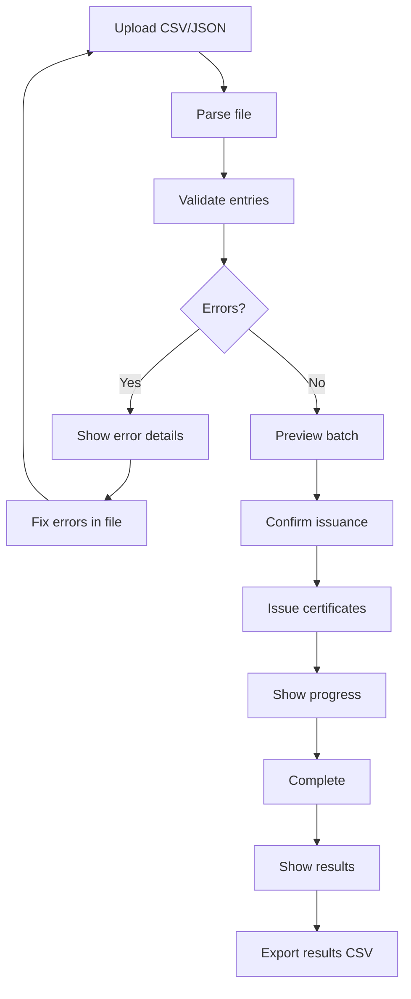

# Batch Issuance — Unit Design

## 1. Overview

| Item | Details |
|------|---------|
| **Module** | Batch Issuance |
| **File** | `src/lib/credentials/batch.ts` |
| **Purpose** | Issue multiple certificates in one operation |
| **Dependencies** | Certificate Service, Encoder/Decoder |

---

## 2. Purpose

The Batch Issuance module allows Course Providers to issue multiple certificates at once by uploading a CSV or JSON file containing recipient information.

---

## 3. Public API

### 3.1 Functions

```typescript
// Parse batch file (CSV or JSON)
function parseBatchFile(
  file: File
): Promise<ParseBatchResult>

// Validate batch entries
function validateBatchEntries(
  entries: BatchEntry[],
  template?: Template
): ValidationResult

// Issue batch certificates
async function issueBatchCertificates(
  signer: ccc.Signer,
  params: BatchIssueParams
): Promise<BatchIssueResult>

// Preview batch before issuing
function previewBatch(
  entries: BatchEntry[],
  clusterId: string
): BatchPreview
```

### 3.2 Types

```typescript
interface BatchEntry {
  row: number;
  recipientAddress: string;
  recipientName?: string;
  courseName: string;
  completionDate: string;
  grade?: string;
  score?: number;
  skills?: string[];
  metadata?: Record<string, any>;
  errors?: string[];
  valid: boolean;
}

interface ParseBatchResult {
  entries: BatchEntry[];
  totalRows: number;
  validCount: number;
  invalidCount: number;
}

interface BatchIssueParams {
  clusterId: string;
  issuerName: string;
  issuerDescription?: string;
  entries: BatchEntry[];
  expirationDate?: string;
  templateId?: string;
  onProgress?: (progress: BatchProgress) => void;
}

interface BatchProgress {
  current: number;
  total: number;
  currentAddress: string;
  status: 'encoding' | 'building' | 'signing' | 'sending';
}

interface BatchIssueResult {
  total: number;
  successful: number;
  failed: number;
  certificates: BatchCertificateResult[];
  errors: BatchError[];
}

interface BatchCertificateResult {
  row: number;
  recipientAddress: string;
  certificateId?: string;
  transactionHash?: string;
  success: boolean;
  error?: string;
}

interface BatchPreview {
  totalEntries: number;
  validEntries: BatchEntry[];
  invalidEntries: BatchEntry[];
  estimatedFee: string;
  warnings: string[];
}
```

---

## 4. Function Specifications

### 4.1 parseBatchFile

**Purpose**: Parse CSV or JSON file containing batch recipient data.

**Parameters**:
| Param | Type | Required | Description |
|-------|------|----------|-------------|
| `file` | `File` | Yes | CSV or JSON file |

**Returns**: `ParseBatchResult`

**Supported Formats**:

**CSV Format**:
```csv
recipientAddress,recipientName,courseName,completionDate,grade,skills
ckt1q...123,John Doe,CKB Basics,2024-01-15,A,Rust;CKB-VM
ckt1q...456,Jane Smith,CKB Basics,2024-01-16,B+,CKB-VM
```

**JSON Format**:
```json
[
  {
    "recipientAddress": "ckt1q...123",
    "recipientName": "John Doe",
    "courseName": "CKB Basics",
    "completionDate": "2024-01-15",
    "grade": "A",
    "skills": ["Rust", "CKB-VM"]
  }
]
```

### 4.2 validateBatchEntries

**Purpose**: Validate all batch entries before issuance.

**Returns**: `ValidationResult`

**Validation Rules**:
| Check | Rule |
|-------|------|
| Address format | Valid CKB address |
| Date format | Valid ISO date |
| Required fields | All required fields present |

### 4.3 previewBatch

**Purpose**: Preview batch before issuing.

**Returns**: `BatchPreview`

### 4.4 issueBatchCertificates

**Purpose**: Issue certificates for all valid entries.

**Parameters**:
| Param | Type | Required | Description |
|-------|------|----------|-------------|
| `signer` | `ccc.Signer` | Yes | Provider's wallet |
| `params` | `BatchIssueParams` | Yes | Batch issuance parameters |

**Returns**: `Promise<BatchIssueResult>`

**Note**: MVP uses individual transactions per certificate.

---

## 5. Batch Processing Flow



---

## 6. UI Components

### 6.1 Batch Upload Component

```
┌─────────────────────────────────────────────┐
│  Batch Certificate Issuance                │
├─────────────────────────────────────────────┤
│  1. Upload File                             │
│  ┌─────────────────────────────────────┐   │
│  │  Drop CSV or JSON file here          │   │
│  │  or click to browse                  │   │
│  └─────────────────────────────────────┘   │
│                                             │
│  2. Preview (3 entries)                   │
│  ┌─────────────────────────────────────┐   │
│  │ Address         │ Name    │ Course   │   │
│  │ ckt1q...123    │ John    │ CKB 101  │   │
│  │ ckt1q...456    │ Jane    │ CKB 101  │   │
│  │ ckt1q...789    │ Bob     │ CKB 101  │   │
│  └─────────────────────────────────────┘   │
│                                             │
│  [Cancel]                    [Issue 3]     │
└─────────────────────────────────────────────┘
```

### 6.2 Progress Display

```
┌─────────────────────────────────────────────┐
│  Issuing Certificates...                   │
├─────────────────────────────────────────────┤
│  ████████████░░░░░░░░░  12/50            │
│                                             │
│  Current: ckt1q...abc                      │
│  Status: Encoding...                        │
│                                             │
│  Completed: 12                             │
│  Failed: 0                                  │
└─────────────────────────────────────────────┘
```

---

## 7. Error Handling

### 7.1 Parse Errors

| Error | Description |
|-------|-------------|
| `INVALID_FILE_TYPE` | Not CSV or JSON |
| `EMPTY_FILE` | File has no data |
| `PARSING_ERROR` | Malformed file structure |

### 7.2 Validation Errors

| Error | Description |
|-------|-------------|
| `INVALID_ADDRESS` | Malformed wallet address |
| `INVALID_DATE` | Invalid date format |
| `MISSING_FIELD` | Required field empty |

### 7.3 Issuance Errors

| Error | Description |
|-------|-------------|
| `INSUFFICIENT_BALANCE` | Not enough CKB for batch |
| `TRANSACTION_FAILED` | CKB transaction failed |

---

## 8. Performance Considerations

### 8.1 Batch Size Limits

| Batch Size | Recommended | Max |
|------------|-------------|-----|
| MVP | 10-50 | 100 |

### 8.2 Estimated Costs

```
Per Certificate:
- Capacity: ~150 CKB (Spore DOB)
- Fee: ~0.001 CKB
- Total: ~151 CKB per certificate

For 100 certificates:
- Total CKB: ~15,100 CKB
```

---

## 9. Testing

### 9.1 Unit Tests

| Test Case | Expected Result |
|-----------|-----------------|
| Parse valid CSV | 10 entries |
| Parse valid JSON | 10 entries |
| Parse invalid file | Throws error |
| Parse empty file | Throws EMPTY_FILE |
| Validate valid entries | All valid |
| Validate invalid addresses | Marked invalid |

### 9.2 Integration Tests

| Test Case | Expected Result |
|-----------|-----------------|
| Issue 5 certificates | 5 successful |
| Issue with 1 invalid | 4 successful, 1 failed |

---

## 10. Related Documents

| Document | Path |
|----------|------|
| Implementation Architecture | `Design_spec/Implementation_Architecture.md` |
| Certificate Service | `Design_spec/03_Certificate_Service.md` |
| Template Service | `Design_spec/05_Template_Service.md` |

---

*Version: 1.0*
*Last Updated: 2026-08-11*
