# DOB Credential & Badge Protocol — Implementation Architecture

## Table of Contents

1. [Overview](#1-overview)
2. [Feature Specification](#2-feature-specification)
3. [System Architecture](#3-system-architecture)
4. [Project Structure](#4-project-structure)
5. [Data Structures](#5-data-structures)
6. [Module Design](#6-module-design)
7. [User Flows](#7-user-flows)
8. [Custom On-Chain Scripts (Future)](#8-custom-on-chain-scripts-future)
9. [Testing Strategy](#9-testing-strategy)
10. [Deployment Configuration](#10-deployment-configuration)
11. [Milestones](#11-milestones)

---

## 1. Overview

This document describes the implementation architecture for the DOB Credential & Badge Protocol, a verifiable credentials system built on CKB using the Spore Protocol.

### 1.1 Design Principles

- **Self-Sovereign**: Users own their credentials as on-chain assets
- **Composable**: Built on existing standards (W3C VC, Spore, CCC SDK)
- **Minimal Viable**: Start with MVP, extend features iteratively
- **CKB-Native**: Leverage CKB's unique advantages (zero fees, on-chain storage)

---

## 2. Feature Specification

### 2.1 Feature Matrix

| Feature | Priority | Description |
|---------|----------|-------------|
| **F1: Wallet Connection** | P0 | Connect wallet via JoyID, MetaMask, Neuron, Portal |
| **F2: Cluster Creation** | P0 | Issuer creates credential Clusters |
| **F3: Credential Issuance** | P0 | Mint credential DOBs to recipients |
| **F4: Credential Display** | P0 | View credentials in holder dashboard |
| **F5: Credential Verification** | P0 | Query and verify credential validity |
| **F6: Credential Presentation** | P1 | Share credential details/copy ID |
| **F7: Non-Transferable** | P1 | Soulbound credentials cannot be transferred |
| **F8: Expiration** | P1 | Time-based credential validity |
| **F9: Revocation** | P2 | Issuer can mark credentials as revoked |
| **F10: Credential Types** | P0 | Support multiple credential types (course, event, cert) |

### 2.2 Feature Details

#### F1: Wallet Connection
- Support multiple wallets: JoyID (WebAuthn), MetaMask (Omnilock), Neuron, Portal Wallet
- Use `@ckb-ccc/connector-react` for React integration
- Display connected wallet status and address
- Handle disconnection and reconnection

#### F2: Cluster Creation
- Issuer creates a Cluster for each credential type/organization
- Cluster stores: name, description, credential policy
- Cluster owner controls credential issuance
- Cluster ID used as issuer identifier in credentials

#### F3: Credential Issuance
- Issue credentials as Spore DOBs
- Credential DNA stores W3C VC-compatible JSON
- Support multiple credential types:
  - Course Completion
  - Event Attendance
  - Professional Certification
- Associate credentials with issuer's Cluster

#### F4: Credential Display
- Holder sees all credentials in their wallet
- Display credential summary: type, title, issuer, date
- Show credential status: active, expired, revoked
- Link to full credential details

#### F5: Credential Verification
- Input: Credential ID (Spore DOB ID)
- Output: Verification result with details
- Verify: issuer, validity, expiration, revocation status
- Show verification timestamp

#### F6: Credential Presentation
- Copy credential ID to clipboard
- Open in CKB Explorer
- Display full credential JSON
- Generate shareable verification link (future)

#### F7: Non-Transferable (Soulbound)
- Credentials locked to recipient wallet
- Cannot be transferred after issuance
- Enforced by custom Type Script (future) or policy

#### F8: Expiration
- Optional expiration date in credential DNA
- UI shows "Expired" badge for expired credentials
- Verification returns expired status

#### F9: Revocation
- Issuer can mark credential as revoked
- Revocation stored in credential status field
- Verification returns revoked status

#### F10: Credential Types
| Type | Fields | Policy |
|------|--------|--------|
| **Course Completion** | course name/description, completion date, grade, skills | transferable or not |
| **Event Attendance** | event name/dates, location, role | non-transferable |
| **Professional Cert** | certification name, issuing body, validity period | non-transferable |

### 2.3 User Roles

| Role | Capabilities |
|------|-------------|
| **Issuer** | Create Clusters, Issue Credentials, Revoke Credentials |
| **Holder** | View Own Credentials, Present Credentials, Transfer (if allowed) |
| **Verifier** | Verify Credential Validity, Check Issuer, Check Expiration |

---

## 3. System Architecture

### 3.1 Architecture Overview

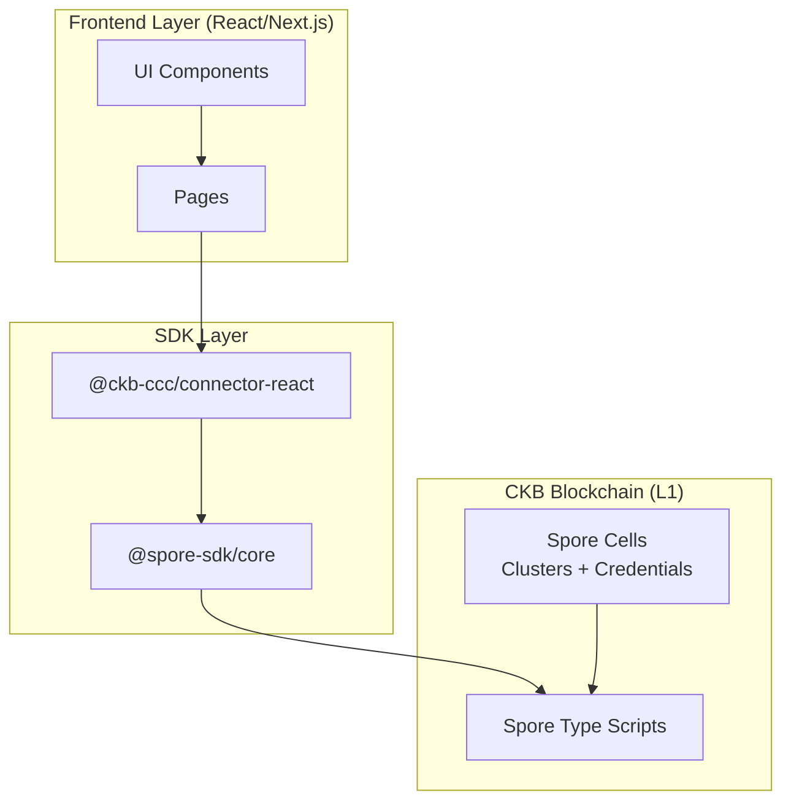

### 3.2 Component Interaction

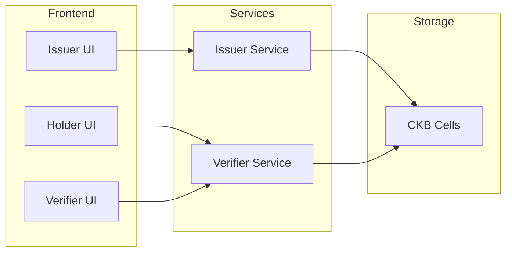

### 3.3 Data Flow

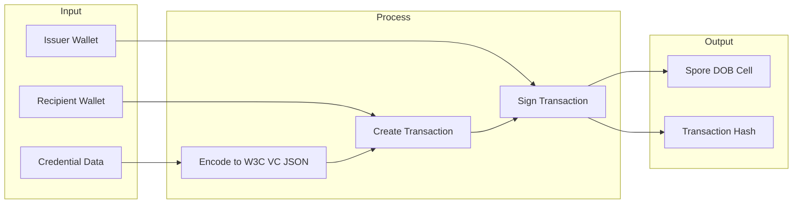

---

## 4. Project Structure

### 4.1 Directory Layout

```
dob-credential-protocol/
├── src/
│   ├── app/                          # Next.js App Router pages
│   │   ├── layout.tsx               # Root layout with CCC Provider
│   │   ├── page.tsx                 # Landing page
│   │   ├── issuer/
│   │   │   └── page.tsx             # Issuer dashboard
│   │   ├── holder/
│   │   │   └── page.tsx             # Holder dashboard
│   │   └── verifier/
│   │       └── page.tsx             # Verification page
│   │
│   ├── components/                   # Reusable React components
│   │   ├── ui/                      # Generic UI components
│   │   │   ├── Button.tsx
│   │   │   ├── Card.tsx
│   │   │   ├── Input.tsx
│   │   │   └── Modal.tsx
│   │   ├── wallet/
│   │   │   └── WalletConnect.tsx
│   │   ├── credential/
│   │   │   ├── CredentialCard.tsx
│   │   │   ├── CredentialDetail.tsx
│   │   │   └── CredentialForm.tsx
│   │   ├── cluster/
│   │   │   ├── ClusterCard.tsx
│   │   │   └── ClusterForm.tsx
│   │   └── verification/
│   │       └── VerifyResult.tsx
│   │
│   ├── lib/                         # Business logic
│   │   ├── ckb/                     # CKB client configuration
│   │   │   ├── config.ts            # Network & script configs
│   │   │   └── client.ts            # Client setup
│   │   ├── credentials/              # Credential business logic
│   │   │   ├── types.ts             # TypeScript interfaces
│   │   │   ├── encoder.ts           # W3C VC JSON encoding
│   │   │   ├── decoder.ts           # W3C VC JSON decoding
│   │   │   ├── issuer.ts            # Credential issuance logic
│   │   │   └── verifier.ts          # Credential verification logic
│   │   └── utils/
│   │       └── formatters.ts        # Utility functions
│   │
│   └── styles/
│       └── globals.css              # Global styles
│
├── contracts/                        # Rust on-chain scripts (future)
│   ├── Cargo.toml
│   └── src/
│       ├── main.rs
│       └── credential.rs
│
├── package.json
├── tsconfig.json
├── next.config.js
├── tailwind.config.js
└── README.md
```

### 4.2 Module Responsibilities

| Module | Responsibility |
|--------|----------------|
| `app/` | Page components and routing |
| `components/ui/` | Generic UI primitives |
| `components/wallet/` | Wallet connection UI |
| `components/credential/` | Credential display and forms |
| `components/cluster/` | Cluster management UI |
| `lib/ckb/` | CKB client and configuration |
| `lib/credentials/` | Credential business logic |
| `contracts/` | Custom on-chain scripts |

---

## 5. Data Structures

### 5.1 Credential DNA (W3C VC Compatible)

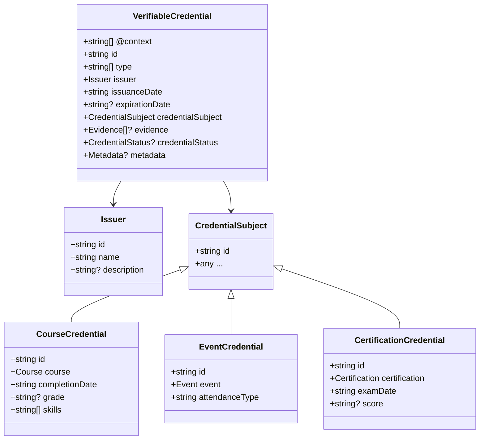

### 5.2 TypeScript Interfaces

```typescript
// Credential Types
interface VerifiableCredential {
  "@context": string[];
  id: string;
  type: string[];
  issuer: Issuer;
  issuanceDate: string;
  expirationDate?: string;
  credentialSubject: CredentialSubject;
  evidence?: Evidence[];
  credentialStatus?: CredentialStatus;
  metadata?: CredentialMetadata;
}

interface Issuer {
  id: string;
  name: string;
  description?: string;
}

interface CredentialSubject {
  id: string;
  [key: string]: any;
}

// Credential-specific subjects
interface CourseCredential extends CredentialSubject {
  course: {
    name: string;
    description: string;
    duration: string;
    institution: string;
  };
  completionDate: string;
  grade?: string;
  skills: string[];
}

interface EventCredential extends CredentialSubject {
  event: {
    name: string;
    description: string;
    startDate: string;
    endDate: string;
    location: string;
  };
  attendanceType: 'in-person' | 'virtual' | 'hybrid';
}

interface CertificationCredential extends CredentialSubject {
  certification: {
    name: string;
    issuingBody: string;
    level: string;
    validityPeriod: string;
  };
  examDate: string;
  score?: number;
}

// Cluster Configuration
interface ClusterConfig {
  name: string;
  description: string;
  credentialPolicy: CredentialPolicy;
  metadata?: {
    issuerUrl?: string;
    revocationEndpoint?: string;
  };
}

interface CredentialPolicy {
  transferable: boolean;
  requiresIssuerSignature: boolean;
  maxIssuancePerRecipient?: number;
  allowRenewal: boolean;
  expirationRequired: boolean;
  revocationEnabled: boolean;
}

// Verification
interface VerificationResult {
  valid: boolean;
  credentialId: string;
  issuer: {
    id: string;
    name: string;
    clusterVerified: boolean;
  };
  holder: {
    address: string;
    ownershipVerified: boolean;
  };
  credential: {
    type: string[];
    issuanceDate: string;
    expirationDate?: string;
    isExpired: boolean;
    isRevoked: boolean;
  };
  timestamp: string;
}
```

---

## 6. Module Design

### 6.1 Module Overview

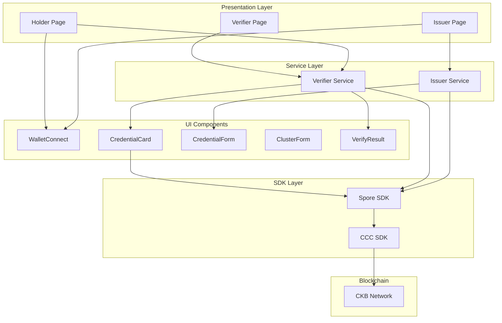

### 6.2 Service Module Responsibilities

| Module | Operations | External Dependencies |
|--------|-----------|----------------------|
| **Issuer Service** | `createCluster`, `issueCourseCredential`, `issueEventBadge`, `issueCertification` | Spore SDK, CCC |
| **Verifier Service** | `verifyCredential`, `getHolderCredentials`, `getIssuerCredentials` | CCC, Spore SDK |
| **Encoder** | `encodeCredentialDNA`, `validateCredentialDNA` | None |
| **Decoder** | `decodeCredentialDNA`, `isExpired`, `isRevoked`, `formatDisplay` | None |

### 6.3 CCC & Spore SDK Usage

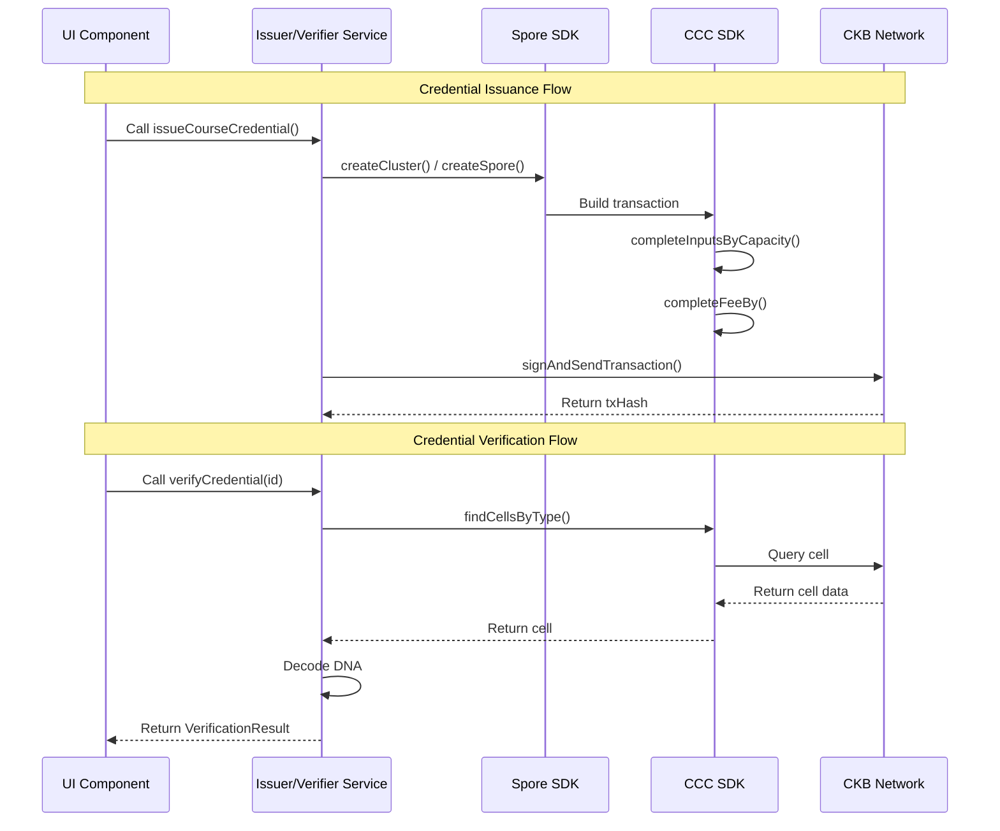

---

## 7. User Flows

### 7.1 Credential Issuance Flow

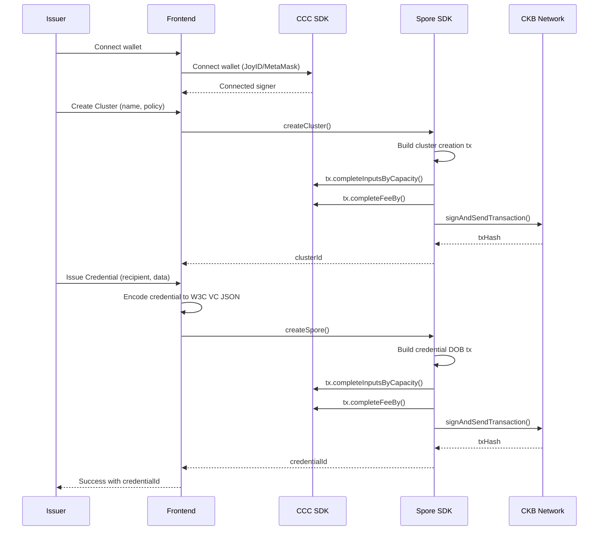

### 7.2 Credential Verification Flow

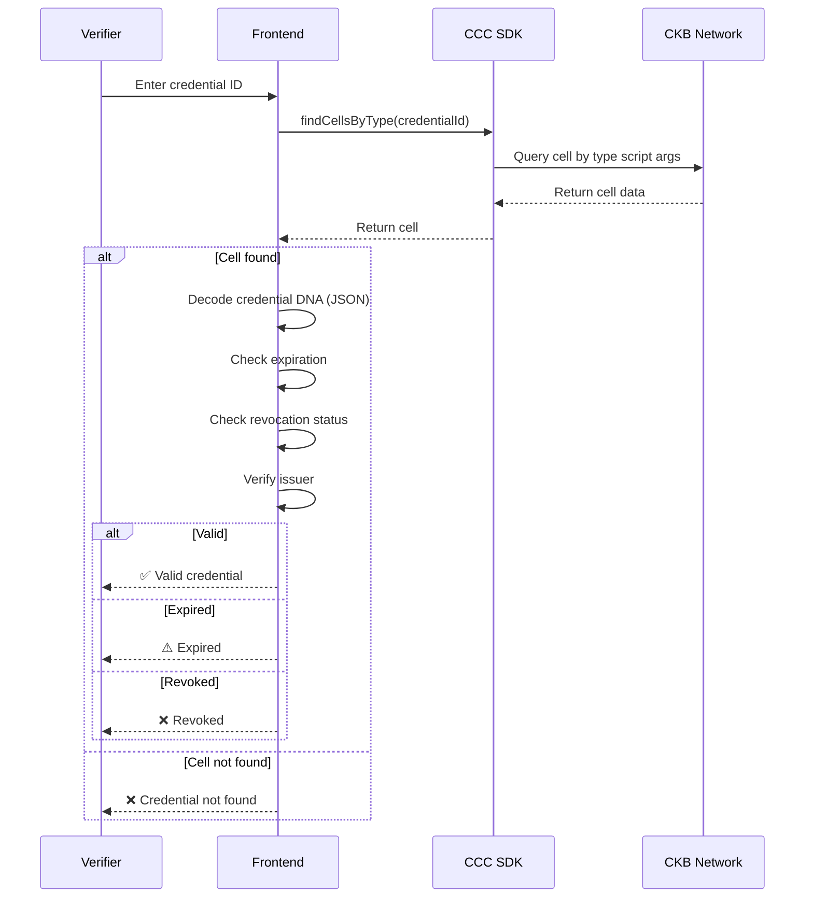

### 7.3 Holder Credential Management Flow

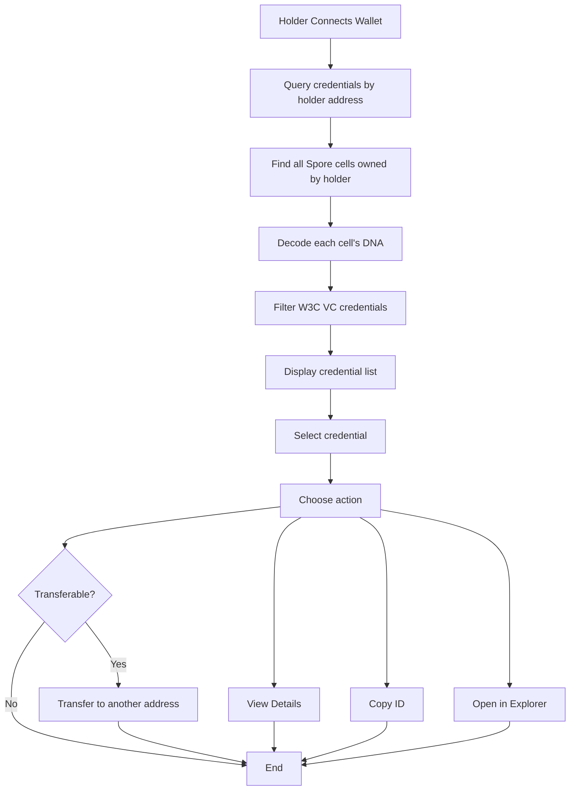

---

## 8. Custom On-Chain Scripts (Future)

### 8.1 Soulbound Credential Script

For non-transferable credentials, a custom Type Script may be needed.

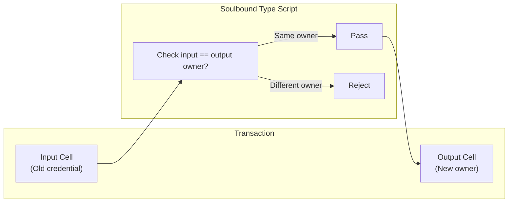

### 8.2 Script Specifications

| Script | Type | Purpose |
|--------|------|---------|
| `credential-soulbound` | Type Script | Enforce non-transferability |
| `credential-revocable` | Type Script | Allow issuer revocation |
| `credential-expiring` | Type Script | Auto-expire after timestamp |

---

## 9. Testing Strategy

### 9.1 Test Layers

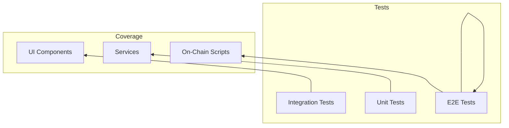

### 9.2 Test Matrix

| Test | Target | Tools |
|------|--------|-------|
| Unit Tests | Encoder/Decoder logic | Jest / Vitest |
| Unit Tests | Service functions | Jest / Vitest |
| Integration Tests | Transaction building | CCC + Mock |
| Integration Tests | Type Script logic | ckb-testtool |
| E2E Tests | Full flows | Playwright |

---

## 10. Deployment Configuration

### 10.1 Environment Configuration

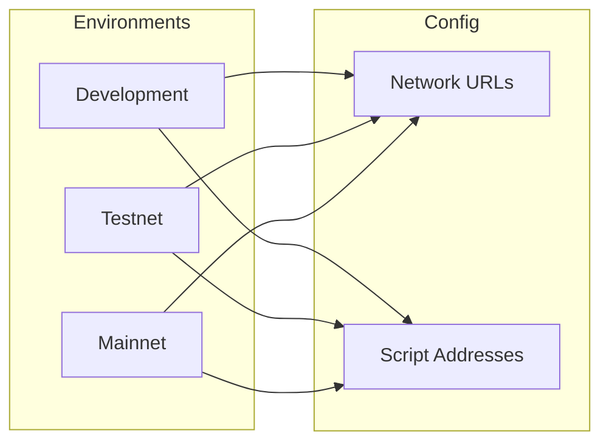

### 10.2 Network Configuration

| Environment | Network | CKB Node | Indexer |
|-------------|---------|----------|---------|
| Development | OffCKB Devnet | localhost:28114 | localhost:28114 |
| Testnet | CKB Testnet | testnet.ckb.dev | testnet.ckb.dev |
| Mainnet | CKB Mainnet | mainnet.ckb.com | mainnet.ckb.com |

---

## 11. Milestones

### 11.1 Timeline Overview

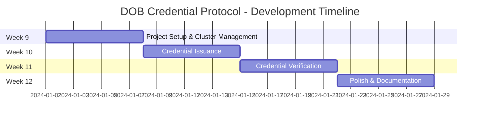

### 11.2 Detailed Milestones

| Week | Milestone | Deliverables | Success Criteria |
|------|-----------|--------------|------------------|
| **Week 9** | Project Setup & Cluster Management | Project scaffold, CCC + Spore integration, Cluster creation UI, Cluster listing | Issuer can create and view Clusters |
| **Week 10** | Credential Issuance | Credential forms (course, event, cert), W3C VC JSON encoding, Issuance transaction, Credential listing | Issuer can issue credentials, Holder can view them |
| **Week 11** | Credential Verification | Verification page, Credential detail view, Verification result display | Verifier can verify any credential |
| **Week 12** | Polish & Documentation | UI/UX improvements, Error handling, Testing, README | All features work, Tests pass |

### 11.3 Feature Release Plan

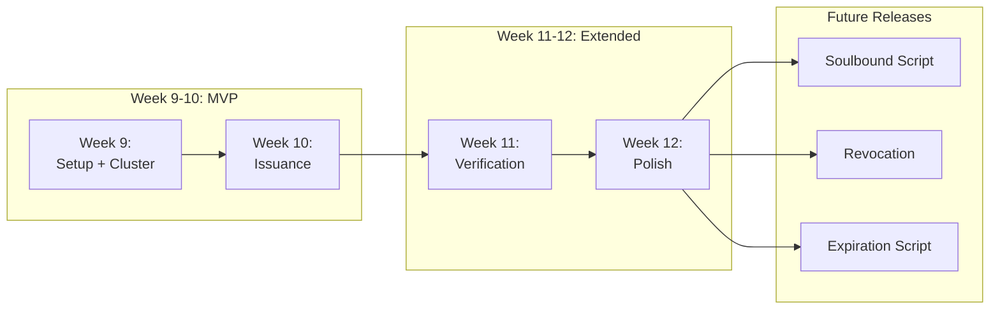

---

## Appendix A: Key References

| Resource | URL |
|----------|-----|
| W3C VC Data Model | https://www.w3.org/TR/vc-data-model/ |
| Spore Protocol | https://docs.spore.pro/ |
| DOB/0 Protocol | https://docs.spore.pro/dob/dob0-protocol |
| CCC SDK | https://docs.ckbccc.com |
| Spore SDK | https://github.com/sporeprotocol/spore-sdk |

---

*Document Version: 1.0*
*Last Updated: 2026-08-11*
*Author: Claude (for CKBuilder Week 8)*
