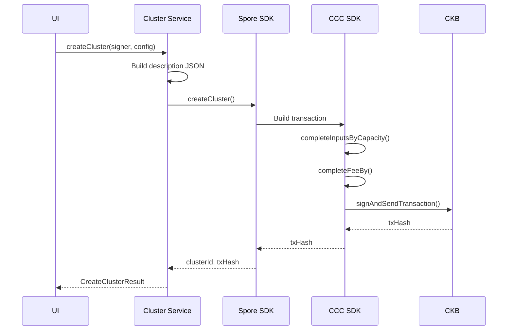

# Cluster Service — Unit Design

## 1. Overview

| Item | Details |
|------|---------|
| **Module** | Cluster Service |
| **File** | `src/lib/ckb/cluster.ts` |
| **Purpose** | Manage Course Provider registration via Spore Clusters |
| **Dependencies** | `@ckb-ccc/spore`, `@ckb-ccc/core` |

---

## 2. Purpose

The Cluster Service handles the creation and management of Spore Clusters, which represent Course Providers in the CKB Credential Registry. Each Cluster is created by a provider and serves as the issuer identity for all certificates they issue.

---

## 3. Public API

### 3.1 Functions

```typescript
// Create a new Cluster for a Course Provider
async function createCluster(
  signer: ccc.Signer,
  config: ClusterConfig
): Promise<CreateClusterResult>

// Get all Clusters owned by a provider
async function getProviderClusters(
  client: ccc.Client,
  ownerLock: Script
): Promise<Cluster[]>

// Get a specific Cluster by ID
async function getCluster(
  client: ccc.Client,
  clusterId: string
): Promise<Cluster | null>
```

### 3.2 Types

```typescript
interface ClusterConfig {
  name: string;
  description: string;
  providerInfo?: ProviderInfo;
  certificatePolicy?: CertificatePolicy;
}

interface ProviderInfo {
  url?: string;
  logo?: string;
  contact?: string;
}

interface CertificatePolicy {
  transferable: boolean;
  expirationDefault?: string;  // ISO 8601 duration e.g., "P1Y"
  allowRenewal: boolean;
  revocationEnabled: boolean;
}

interface CreateClusterResult {
  clusterId: string;      // Type script args
  transactionHash: string;
}

interface Cluster {
  id: string;
  name: string;
  description: string;     // JSON string with providerInfo + policy
  owner: string;          // Owner lock script args
  createdAt: string;
  cell?: Cell;
}
```

---

## 4. Function Specifications

### 4.1 createCluster

**Purpose**: Create a new Spore Cluster for a Course Provider.

**Parameters**:
| Param | Type | Required | Description |
|-------|------|----------|-------------|
| `signer` | `ccc.Signer` | Yes | Wallet signer for signing transaction |
| `config` | `ClusterConfig` | Yes | Cluster configuration |

**Process**:
1. Build description JSON from config
2. Call Spore SDK `createCluster()`
3. Complete inputs and fee
4. Sign and send transaction
5. Extract clusterId from output

**Returns**: `CreateClusterResult`

**Errors**:
| Error | Condition |
|-------|-----------|
| `INSUFFICIENT_BALANCE` | Not enough CKB for cluster creation |
| `INVALID_CONFIG` | Invalid cluster configuration |
| `WALLET_NOT_CONNECTED` | Signer not available |

**Transaction Details**:
```
Input:  Provider's CKB cells
Output: Cluster Cell (Type: SPORE_CLUSTER, Lock: Provider)
Fee:    ~0.001 CKB
```

### 4.2 getProviderClusters

**Purpose**: Get all Clusters owned by a provider address.

**Parameters**:
| Param | Type | Required | Description |
|-------|------|----------|-------------|
| `client` | `ccc.Client` | Yes | CKB client |
| `ownerLock` | `Script` | Yes | Provider's lock script |

**Returns**: `Cluster[]`

**Process**:
1. Query indexer for cells with Type: SPORE_CLUSTER
2. Filter by owner's lock script
3. Parse description JSON
4. Return Cluster objects

### 4.3 getCluster

**Purpose**: Get a specific Cluster by its ID.

**Parameters**:
| Param | Type | Required | Description |
|-------|------|----------|-------------|
| `client` | `ccc.Client` | Yes | CKB client |
| `clusterId` | `string` | Yes | Cluster ID (type script args) |

**Returns**: `Cluster | null`

**Process**:
1. Find cell by type script with matching args
2. Parse description JSON
3. Return Cluster or null

---

## 5. Data Flow



---

## 6. Implementation Notes

### 6.1 Description JSON Structure

```json
{
  "name": "CKB Academy",
  "description": "Official CKB developer training provider",
  "providerInfo": {
    "url": "https://ckb.academy",
    "logo": "https://...",
    "contact": "contact@ckb.academy"
  },
  "certificatePolicy": {
    "transferable": false,
    "expirationDefault": "P1Y",
    "allowRenewal": true,
    "revocationEnabled": true
  }
}
```

### 6.2 Cluster ID

Cluster ID = Type script args của Cluster Cell
- Format: 32-byte hex string
- Derived from transaction during creation

### 6.3 CCC Spore SDK Reference

```typescript
import { createSporeCluster } from '@ckb-ccc/spore';

const { tx, id: clusterId } = await createSporeCluster({
  signer: liveSigner,
  data: {
    name: config.name,
    description: JSON.stringify(descriptionObj),
  },
  to: ownerLockScript,
});

await tx.completeInputsByCapacity(liveSigner);
await tx.completeFeeBy(liveSigner, 1000);
const txHash = await liveSigner.sendTransaction(tx);
```

---

## 7. Testing

### 7.1 Unit Tests

| Test Case | Expected Result |
|-----------|-----------------|
| Create cluster with valid config | Returns clusterId and txHash |
| Create cluster with missing name | Throws INVALID_CONFIG |
| Create cluster with insufficient balance | Throws INSUFFICIENT_BALANCE |
| Get provider clusters | Returns array of clusters |
| Get non-existent cluster | Returns null |

### 7.2 Integration Tests

| Test Case | Expected Result |
|-----------|-----------------|
| Create cluster → Query cluster | Cluster exists on chain |
| Create cluster → Get by ID | Returns correct cluster data |

---

## 8. Related Documents

| Document | Path |
|----------|------|
| Implementation Architecture | `Design_spec/Implementation_Architecture.md` |
| Certificate Service | `Design_spec/03_Certificate_Service.md` |

---

*Version: 1.0*
*Last Updated: 2026-08-11*
