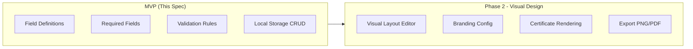

# Template Service — Unit Design

> **MVP Scope**: This spec covers the MVP implementation. Visual editor and rendering are deferred to Phase 2.

## 1. Overview

| Item | Details |
|------|---------|
| **Module** | Template Service |
| **File** | `src/lib/credentials/templates.ts` |
| **Purpose** | Manage certificate templates with form field definitions |
| **Dependencies** | None (client-side storage) |

---

## 2. Purpose

The Template Service manages certificate templates that providers can create and use for consistent certificate issuance. MVP focuses on **form structure** (field definitions, validation) without visual design capabilities.

---

## 2.1 MVP Scope vs Phase 2



---

## 3. Template Components (MVP)

### 3.1 Form Structure
- Field definitions (what data to collect)
- Required fields (mandatory vs optional)
- Validation rules (data constraints)
- Default values

### 3.2 NOT in MVP
- Visual layout selection
- Typography customization
- Color themes
- Logo upload
- Certificate rendering/export

---

## 4. Public API

### 4.1 Functions

```typescript
// Template CRUD
function createTemplate(clusterId: string, template: TemplateInput): Template
function getTemplates(clusterId: string): Template[]
function getTemplate(clusterId: string, templateId: string): Template | null
function updateTemplate(clusterId: string, templateId: string, updates: Partial<TemplateInput>): Template
function deleteTemplate(clusterId: string, templateId: string): void

// Template Application
function applyTemplate(template: Template, data: Record<string, any>): CertificateData
function validateTemplateFields(template: Template, data: Record<string, any>): ValidationResult
```

### 4.2 Types

```typescript
// ===== CORE TEMPLATE TYPES (MVP) =====

interface Template {
  id: string;
  clusterId: string;
  name: string;
  description: string;
  version: string;
  fields: TemplateField[];
  requiredFields: string[];
  defaultValues?: Record<string, any>;
  metadata: TemplateMetadata;
  createdAt: string;
  updatedAt: string;
}

interface TemplateInput {
  name: string;
  description: string;
  fields: TemplateField[];
  requiredFields: string[];
  defaultValues?: Record<string, any>;
}

interface TemplateMetadata {
  createdBy: string;
  lastModifiedBy: string;
  usageCount: number;
}

// ===== FORM FIELD TYPES (MVP) =====

interface TemplateField {
  name: string;
  type: FieldType;
  label: string;
  placeholder?: string;
  required: boolean;
  helpText?: string;
  options?: FieldOption[];
  validation?: FieldValidation;
}

type FieldType =
  | 'text'           // Single line text
  | 'textarea'       // Multi-line text
  | 'email'          // Email address
  | 'url'            // Website URL
  | 'date'           // Date picker
  | 'datetime'       // Date and time
  | 'number'         // Numeric input
  | 'select'         // Dropdown
  | 'multiselect'    // Multiple selection
  | 'radio'          // Radio buttons
  | 'checkbox'       // Checkbox
  | 'skills'         // Skills tags
  | 'grade'          // Grade selector
  | 'readonly';      // Display only (computed values)

interface FieldOption {
  value: string;
  label: string;
  description?: string;
}

interface FieldValidation {
  required?: boolean;
  minLength?: number;
  maxLength?: number;
  min?: number;
  max?: number;
  pattern?: string;
  patternMessage?: string;
}

// ===== VALIDATION =====

interface ValidationResult {
  valid: boolean;
  errors: ValidationError[];
}

interface ValidationError {
  field: string;
  message: string;
}
```

---

## 5. Function Specifications (MVP)

### 5.1 createTemplate

**Process**:
1. Validate template input (name, fields, requiredFields)
2. Generate unique template ID
3. Store template in local storage

```typescript
function createTemplate(clusterId: string, input: TemplateInput): Template {
  // 1. Validate
  validateTemplateInput(input);

  // 2. Generate ID
  const id = `tmpl_${Date.now()}_${randomId()}`;

  // 3. Create template
  const template: Template = {
    id,
    clusterId,
    name: input.name,
    description: input.description,
    version: '1.0',
    fields: input.fields,
    requiredFields: input.requiredFields,
    defaultValues: input.defaultValues,
    metadata: {
      createdBy: currentUser,
      lastModifiedBy: currentUser,
      usageCount: 0,
    },
    createdAt: new Date().toISOString(),
    updatedAt: new Date().toISOString(),
  };

  // 4. Store
  saveTemplate(template);
  return template;
}
```

### 5.2 validateTemplateFields

**Purpose**: Validate form data against template field definitions.

```typescript
function validateTemplateFields(
  template: Template,
  data: Record<string, any>
): ValidationResult {
  const errors: ValidationError[] = [];

  // Check required fields
  for (const fieldName of template.requiredFields) {
    if (!data[fieldName] || String(data[fieldName]).trim() === '') {
      errors.push({
        field: fieldName,
        message: `${fieldName} is required`,
      });
    }
  }

  // Check field validations
  for (const field of template.fields) {
    const value = data[field.name];
    if (value && field.validation) {
      // Type-specific validation
      if (field.type === 'email' && !isValidEmail(value)) {
        errors.push({ field: field.name, message: 'Invalid email format' });
      }
      if (field.type === 'url' && !isValidUrl(value)) {
        errors.push({ field: field.name, message: 'Invalid URL format' });
      }
      // ... other validations
    }
  }

  return { valid: errors.length === 0, errors };
}
```

### 5.3 applyTemplate

**Purpose**: Apply template defaults and merge with user data.

```typescript
function applyTemplate(
  template: Template,
  data: Record<string, any>
): CertificateData {
  // Merge default values with user data
  const merged = { ...template.defaultValues, ...data };

  return {
    issuer: { /* from cluster */ },
    recipient: { address: merged.recipientAddress, name: merged.recipientName },
    course: {
      name: merged.courseName,
      description: merged.courseDescription,
      completionDate: merged.completionDate,
      grade: merged.grade,
      skills: merged.skills,
    },
  };
}
```

---

## 6. Storage Schema

### 6.1 Local Storage

```typescript
// Key: `templates:${clusterId}`
// Value: JSON array of Template objects

interface StoredTemplates {
  version: string;
  templates: Template[];
  lastUpdated: string;
}

localStorage.setItem('templates:cluster_abc123', JSON.stringify({
  version: '1.0',
  templates: [
    { /* template 1 */ },
    { /* template 2 */ },
  ],
  lastUpdated: '2024-01-15T00:00:00Z',
}));
```

---

## 7. Testing

### 7.1 Unit Tests

| Test Case | Expected Result |
|-----------|-----------------|
| Create template with valid fields | Template created with ID |
| Create template with missing name | Throws validation error |
| Create template with missing requiredFields | Throws validation error |
| Get templates for cluster | Returns array of templates |
| Get non-existent template | Returns null |
| Update template | Template updated correctly |
| Delete template | Template removed from storage |
| Validate valid data | `{ valid: true, errors: [] }` |
| Validate missing required field | `{ valid: false, errors: [...] }` |
| Validate invalid email | `{ valid: false, errors: [...] }` |
| Apply template with defaults | Merges default values correctly |

---

## 8. Phase 2: Visual Design (Future)

The following features are deferred to Phase 2:

| Feature | Description |
|---------|-------------|
| Visual Layout Editor | Drag-drop layout builder |
| Color Themes | Multiple theme options |
| Typography Config | Font family, sizes, weights |
| Logo Upload | Provider branding |
| Certificate Rendering | HTML/PDF export |
| Live Preview | Real-time template preview |

---

## 9. Related Documents

| Document | Path |
|----------|------|
| Implementation Architecture | `Design_spec/Implementation_Architecture.md` |
| Certificate Service | `Design_spec/03_Certificate_Service.md` |
| UI Components | `Design_spec/08_UI_Components.md` |

---

*Version: 3.0 (MVP Simplified)*
*Last Updated: 2026-08-20*
